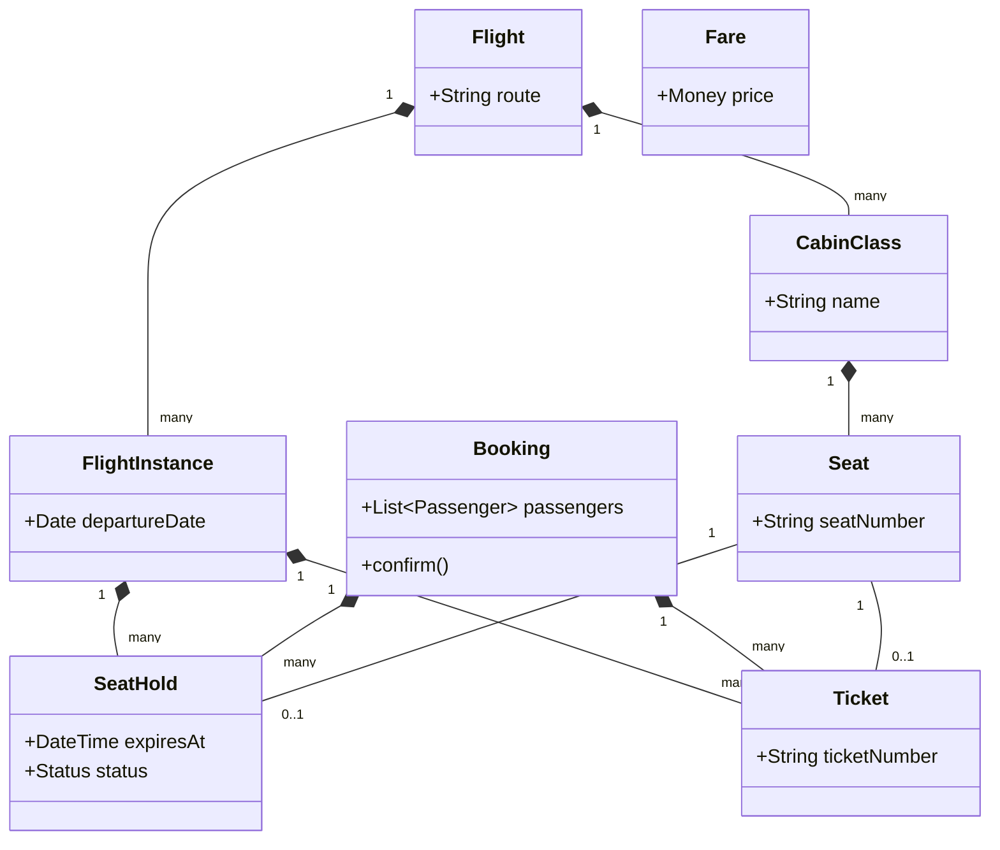
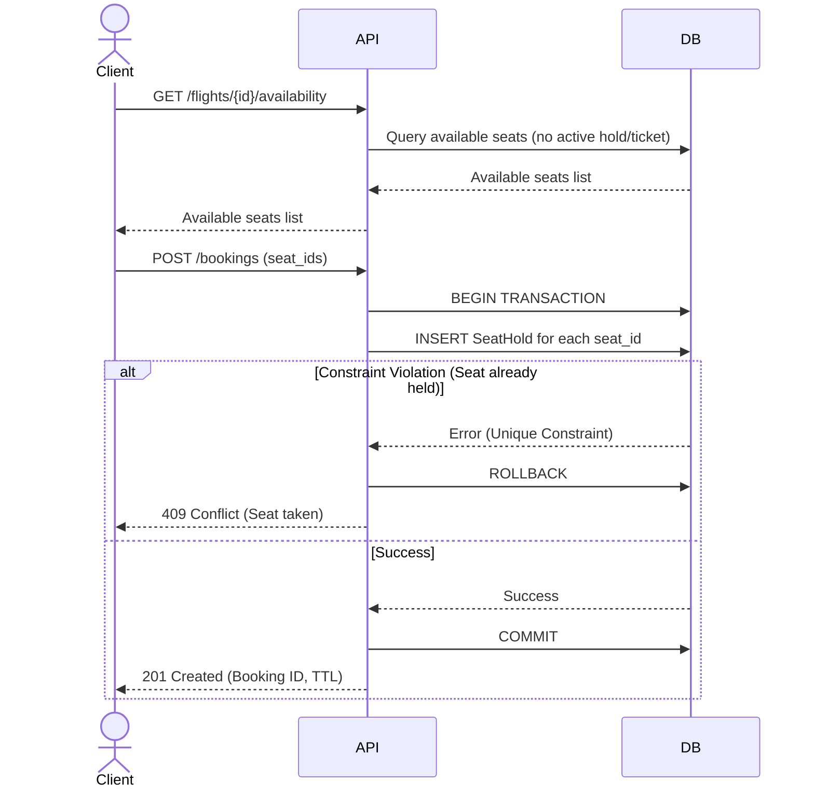
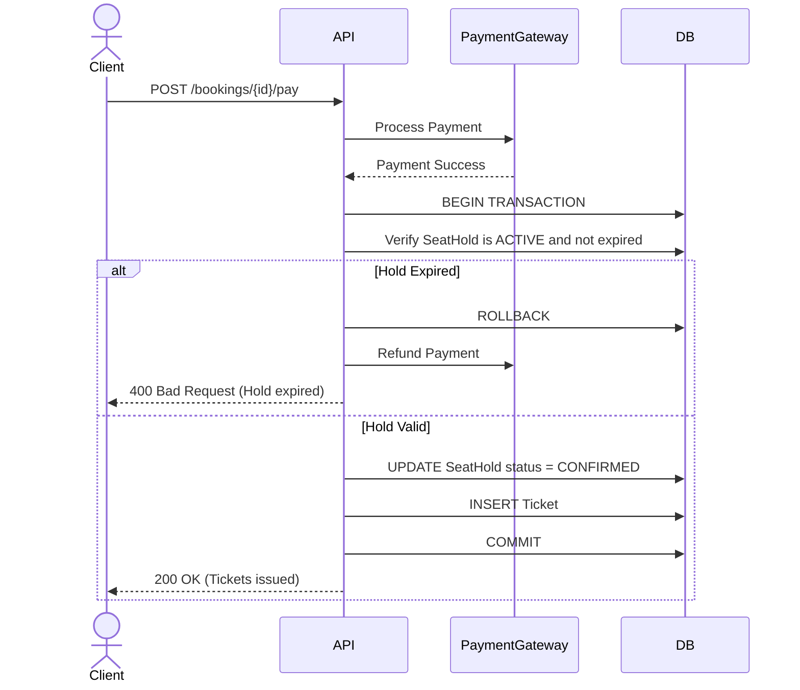

# Seat Booking Diagrams

## Class Diagram (Domain Model)

```mermaid
classDiagram
    class Flight {
        +String route
    }
    class FlightInstance {
        +Date departureDate
    }
    class CabinClass {
        +String name
    }
    class Seat {
        +String seatNumber
    }
    class Fare {
        +Money price
    }
    class Booking {
        +List~Passenger~ passengers
        +confirm()
    }
    class SeatHold {
        +DateTime expiresAt
        +Status status
    }
    class Ticket {
        +String ticketNumber
    }

    Flight "1" *-- "many" FlightInstance
    Flight "1" *-- "many" CabinClass
    CabinClass "1" *-- "many" Seat
    FlightInstance "1" *-- "many" SeatHold
    FlightInstance "1" *-- "many" Ticket
    Booking "1" *-- "many" SeatHold
    Booking "1" *-- "many" Ticket
    Seat "1" -- "0..1" SeatHold
    Seat "1" -- "0..1" Ticket
```

## Sequence Diagram: Search and Hold

```mermaid
sequenceDiagram
    actor Client
    participant API
    participant DB

    Client->>API: GET /flights/{id}/availability
    API->>DB: Query available seats (no active hold/ticket)
    DB-->>API: Available seats list
    API-->>Client: Available seats list

    Client->>API: POST /bookings (seat_ids)
    API->>DB: BEGIN TRANSACTION
    API->>DB: INSERT SeatHold for each seat_id
    alt Constraint Violation (Seat already held)
        DB-->>API: Error (Unique Constraint)
        API->>DB: ROLLBACK
        API-->>Client: 409 Conflict (Seat taken)
    else Success
        DB-->>API: Success
        API->>DB: COMMIT
        API-->>Client: 201 Created (Booking ID, TTL)
    end
```

## Sequence Diagram: Payment and Confirmation

```mermaid
sequenceDiagram
    actor Client
    participant API
    participant PaymentGateway
    participant DB

    Client->>API: POST /bookings/{id}/pay
    API->>PaymentGateway: Process Payment
    PaymentGateway-->>API: Payment Success
    
    API->>DB: BEGIN TRANSACTION
    API->>DB: Verify SeatHold is ACTIVE and not expired
    alt Hold Expired
        API->>DB: ROLLBACK
        API->>PaymentGateway: Refund Payment
        API-->>Client: 400 Bad Request (Hold expired)
    else Hold Valid
        API->>DB: UPDATE SeatHold status = CONFIRMED
        API->>DB: INSERT Ticket
        API->>DB: COMMIT
        API-->>Client: 200 OK (Tickets issued)
    end
```
